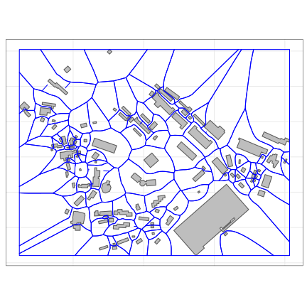

<!-- README.md is generated from README.Rmd. Please edit that file -->

# moter: Generating **MO**rphological **TE**ssellations in **R**

Chris Jochem
*[WorldPop Research Group, University of Southampton](https://www.worldpop.org/)*

The `moter` package is currently a proof-of-concept and experimental package.
Use at your own risk. The code is implementing an algorithm to create
tessellated polygon around building footprints. The generated polygons
efficiently partition a study area space and can be used for as zones for
calculating urban morphometrics from building shapes. The morphological
tessellation (MT) was described by [Fleischmann et al.
(2020)](https://doi.org/10.1016/j.compenvurbsys.2019.101441) and the algorithm
was implemented in [`momepy`](https://docs.momepy.org).

## Installation

The code can be installed from GitHub. It also requires the `sf` package.

```r
devtools::install_github("wcjochem/moter@main")
```


## Basic usage


```r
library(moter)
```

There is currently one primary function, `motess` that takes a set of building
polygons and generates the morphological tessellation as a set of spatial
polygons in `sf` format. In addition, this function requires the footprints to
have a column with a unique identifier and (optionally) takes a bounding box to
limit the extent of the study area.

There are two key parameters affecting the morphological tessellation. The
first, `shrink` is the distance set (in meters) for an inward buffer which
separates adjacent buildings. The second, `limit` is the distance (in meters) to
create points along the edges of the building footprints. Default values have
been provided in the function. Users are directed to Fleischmann et al. (2020)
for further discussion about the sensitivity of these parameters.

This processing may take some time for large collections of building footprints.


```r
# create morphological tessellation
MT <- motess(X, unique_id = "UID", verbose=TRUE)
#> [1] "Inward offset..."
#> [1] "Discretization..."
#> [1] "Generating Voroni diagram..."
#> [1] "Dissolving Voroni polygons..."
#> [1] "Clipping morphological tessellation"
```
The resulting morphological cells are provided as `sf` type spatial polygons
which can be viewed and plotted.


```r
head(MT)
#> Simple feature collection with 6 features and 2 fields
#> geometry type:  POLYGON
#> dimension:      XY
#> bbox:           xmin: 32.61528 ymin: 0.3289504 xmax: 32.62128 ymax: 0.334044
#> geographic CRS: WGS 84
#>   UID   FID_1                       geometry
#> 1   1    7824 POLYGON ((32.61607 0.330807...
#> 2   2  255232 POLYGON ((32.62115 0.330147...
#> 3   3  554880 POLYGON ((32.61701 0.329033...
#> 4   4  746688 POLYGON ((32.61557 0.331966...
#> 5   5  746880 POLYGON ((32.61843 0.332910...
#> 6   6 2292672 POLYGON ((32.61795 0.328950...
```




## References
Fleischmann, M., A. Feliciotti, O. Romice, S. Porta (2020). "Morphological
tessellation as a way of partitioning space: Improving consistency in urban
morphology at the plot scale."  *Computers, Environment, & Urban Systems**, 80,
101441.[https://doi.org/10.1016/j.compenvurbsys.2019.101441](https://doi.org/10.1016/j.compenvurbsys.2019.101441).
